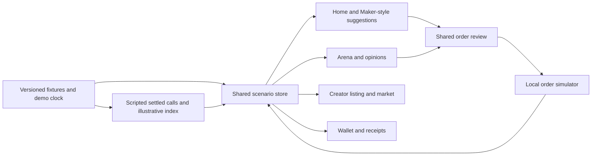

# VistaColosseum — master hackathon PRD

**Version:** 0.5 · **Planning date:** October 1, 2026 · **Updated:** October 4, 2026 · **Status:** demo scope decided; O-01 to O-10 resolved by the user on October 4 ([decision record, October 4](2026-10-04-open-decisions-recommendations.md)), O-11 open with an interim default; Figma frame export and VC coverage audit pending.

**Deadline:** corrected by the user on October 5 to **October 12, 2026, 23:59 America/Los_Angeles** (was October 11, 23:00; see [spec 11, DR-2](../specs/11-verification-and-packaging.md)). Submission channel and format are still unconfirmed. This document proposes priorities and acceptance criteria, not delivery commitments.

Read with the [product roadmap](2026-10-01-vc-hackathon-roadmap.md) and [evidence register](2026-10-01-vc-hackathon-evidence.md). Requirement IDs are stable: retain them when moving requirements into specs; mark removed requirements deferred or superseded rather than renumbering them.

## 1. Product goal and demo promise

Demonstrate a mobile social-trading experience in which a viewer can understand a trader's call, explore opposing views in Arena, inspect a trader's performance market, and see how participation affects a simulated portfolio. A creator can configure and open a **demo** market on their record. The product story connects calls, public records and trader markets; all money, market data, fills, outcomes and fee credits may be simulated.

The 10-day deliverable is a coherent, repeatable interactive demo and recording. It is not a production trading platform. Success means the demonstrated paths work together and the presenter can explain which parts are simulated. Production deployment of VMBE, a validated TPX index, real custody and live trade execution are outside scope.

**Confirmed presentation target:** a PC running a simulated iOS device, clarified by the user on October 2 ([E-U01](2026-10-01-vc-hackathon-evidence.md#e-u01)). **Runtime decided October 4: the Xcode iOS Simulator** running the existing Flutter `ios/` target. The Simulator only runs on macOS, so the presenter machine must be a Mac with Xcode installed; M1 must prove launch and recording on that exact machine. If no Mac is available, the fallback is a Flutter web build in Chrome with a portrait phone frame, and that change must be recorded as a scope decision, not made silently.

**Primary demo roles:** a seeded creator, a seeded spectator/participant, and a presenter who can reset the scenario. These are proposed demo personas, not researched customer segments. Use one simulated device on the PC with a persona switch.

### Verified starting point

**October 2 integration update:** VC main now contains a Flutter app at `ddcfaa350890864b8726732837629bd237a0d603`. The initial October 1 no-app baseline is historical. [E-C03](2026-10-01-vc-hackathon-evidence.md#e-c03) records a bounded source check; existing screens must be assessed against these criteria before scheduling new implementation. No acceptance criterion is marked passed by source presence alone.

| Area | Current evidence | Planning consequence |
|---|---|---|
| VC | Initial review was documentation/assets only (E-C01). Fetched main now has a Flutter shell, feature directories and design assets (E-C03). | Reuse the existing VC app; classify each requirement as verified, partial, missing or untested before estimating remaining work. |
| FMA | Source-backed feed, charts, profiles, order review and paper portfolio; fixtures and local persistence. Not runtime-tested in this review. [E-F02–E-F05](2026-10-01-vc-hackathon-evidence.md#e-f02) | Reference interaction patterns and test cases; do not claim live integration. |
| FMA Arena/Clash | No implementation found on current main; its plan explicitly says Arena has no code. [E-F01](2026-10-01-vc-hackathon-evidence.md#e-f01) | The user's reported frontend baseline is not verified and is contradicted on this branch. Current VC has Arena source (E-C03); assess its coverage independently of the FMA gap. |
| VMBE Arena/Clash | No source domain/routes/migrations found; planned contracts only. [E-B01](2026-10-01-vc-hackathon-evidence.md#e-b01) | Mock formation, participants, clocks, outcomes and records locally. No dependency on finishing a backend. |
| VMBE adjacent services | Price/history, suggestion and account routes exist in source; trading handoff/executor gaps remain. [E-B02](2026-10-01-vc-hackathon-evidence.md#e-b02), [E-B03](2026-10-01-vc-hackathon-evidence.md#e-b03) | Use shapes and boundaries as references; do not rely on deployment or fill execution. |
| Video / Figma | Video inspected. October 2 recheck confirms the Figma plugin is installed/enabled, but its design-reading tools are unavailable in this chat; browser access to the exact node still stops at a WebGL error. No canvas content inspected. [E-V01](2026-10-01-vc-hackathon-evidence.md#e-v01), [E-D01](2026-10-01-vc-hackathon-evidence.md#e-d01) | Behavioral coverage can be planned from the video; Figma-specific requirements and exact design fidelity remain provisional. Plugin installation alone does not close the evidence gap. |

### Evidence vocabulary

- **Observed:** visible in the video, without implying its backend works.
- **Implemented/client-mock:** a concrete source path exists, with local/synthetic data. Runtime success is not claimed here.
- **Specified:** repository prose describing intended behavior, with no corresponding implementation established.
- **Proposed:** desired VC demo behavior in this PRD. Requirements define acceptance targets; existing VC source may already cover some of them, subject to verification against E-C03.
- **Provisional:** affected by a missing reference or unresolved product choice. It may use a stated demo assumption; it must not be represented as verified fidelity.

## 2. Planning assumptions and scope boundaries

| ID | Assumption used to keep work moving | Consequence if wrong |
|---|---|---|
| A-01 | No live integration is mandatory; use mocks especially for VMBE. This follows the user's explicit direction. | A mandatory live sponsor/API requirement needs a bounded replacement plan and a scope cut. It cannot silently expand P0. |
| A-02 | Two developers, one frontend and one backend, confirmed October 4. Because nothing goes live (O-07), the backend developer owns the scenario store, fixtures, mock services and reset logic; the frontend developer owns screens. Interfaces are fixed at M1 so both streams run in parallel from M2. | If either developer is unavailable, collapse to one stream and cut S08 first. |
| A-03 | Runtime confirmed October 4: Xcode iOS Simulator on a macOS presenter machine, using the existing Flutter `ios/` target. | If the presenter machine is not a Mac, the Simulator cannot run. M1 must prove launch on the actual machine; the fallback is a Flutter web build in Chrome with a phone frame. |
| A-04 | Closed October 4: “x” had no supplied meaning and no feature or metric was inferred from it. | None. |
| A-05 | Reproduce the video's economic copy (token supply, market cap, token price, 40% creator share) as the demo narrative. The user accepted on October 4 that this may misrepresent the product's current TPX economics (O-05). The persistent simulation indicator stays: the narrative is a product-story choice, the indicator prevents viewers mistaking demo money for real money. | TPX's ECONOMICS doc still defines no issuance (E-F07). The submission's known-limitations note must say the economics shown are a demo narrative, not the product specification. |
| A-06 | Reuse means reference-guided lightweight implementation under VC's current CONTEXT.md, not wholesale source migration. | A source transplantation strategy would need explicit reconsideration; it is not assumed to save time. |
| A-07 | Reference video length does not establish the hackathon's allowed submission length. | Confirm the official brief before recording. |

**P0 — essential connected demo:** resettable shell; Home call browsing/replay; portfolio entry into market listing; listing acknowledgments and success; market/portfolio chart views and simulated creator fees; Arena cards, sorting and crowd-split filter; one shared simulated order-review path; clear simulation disclosure and a rehearsed recording.

**P1 — only after P0 is stable:** public first-call composition, scripted challenge-to-clash-to-result progression, a separate TPX position ticket, two-person manual copy/payment story, real sharing. P1 work may be omitted without claiming it was implemented.

**Deferred:** production auth/wallet onboarding, funding/withdrawals, live VMBE deployment, real exchange orders, payouts, on-chain programs, settlement oracle, calibrated TPX scoring, production market matching/liquidity, push notifications, AI recommendation/answer engines, moderation infrastructure, broad asset catalogs and app-store release. No production architecture rewrite is necessary for this demo.

## 3. Demo journeys and evidence coverage

| Journey | Sequence and visible result | Basis | Priority / completion boundary |
|---|---|---|---|
| J1 — discover a call | Enter seeded Home → change feed → browse a call → inspect its chart/context → open details or trader record. | Video V01/V09; FMA feed/profile/replay code. | P0; small curated data set, no ranking service. |
| J2 — become a listed creator | Wallet → listing entry → choose ticker/pitch → acknowledge market behavior → create demo market → success → view own market. | Video V02–V06. | P0; local registry and illustrative record. First-call composer is P1 because the video explicitly leaves it unfinished. |
| J3 — understand a clash | Arena → inspect opposing theses → change sort and crowd-split range → view matching cards/count → inspect more opinions. | Video V07/V08; opinion opening is proposed completion of a visible control. | P0; seeded discussions, no posting/moderation backend. |
| J4 — participate deliberately | Call or Arena side → prefilled asset/direction → adjust demo size → review → confirm → simulated position appears in Wallet and Arena participation updates. | Visible entry controls plus FMA order flow; resulting Arena membership is proposed. | P0, one minimal shared ticket; cancel must leave state unchanged. |
| J5 — explain outcomes | View a seeded settled call/record and corresponding illustrative index; distinguish event verdict, trading P&L and market-fee income. | TPX/Arena plans and video narration; dynamic settlement is not demonstrated. | P0 read-only fixtures; P1 adds presenter-controlled progression. |
| J6 — share an order and receive a copy credit | Creator publishes → another persona chooses it → reviews/places their own simulated order → creator sees one illustrative credit. | VC's earlier brief, E-C02; absent from supplied video. | P1 provisional extension, behind a defined reward rule and P0 exit. |

The [evidence register's V01–V09 coverage table](2026-10-01-vc-hackathon-evidence.md#e-v01) accounts for every sampled core surface. No observed feature is silently presented as backend-complete. Minor visible utilities such as deposit, notifications, settings and share may give an explicit demo-only explanation; the main journey controls must function.

## 4. Feature requirements

Each acceptance criterion is a future verification obligation. None is marked passed by authoring this document. P0 criteria apply to the selected demo target; optional criteria apply only when their feature is included.

### S01. Demo foundation and shared state

**Basis:** E-C01; video navigation; FMA shell E-F01; confirmed PC/simulated-iOS target E-U01. **Status:** VC now has a shell (E-C03); shared-state and target-runtime acceptance remain untested. **Dependencies:** runtime and fixture decisions at M0.

| ID | Priority | Requirement and acceptance criteria |
|---|---|---|
| VC-DEM-001 | P0 | Provide one runnable demo on the presenter's PC inside a portrait simulated iOS device, with Home, Arena and Wallet reachable, plus market/profile drill-downs. Mouse clicks, scrolling/dragging and keyboard text entry support every core journey; paging or swipe interactions have a usable PC input equivalent. Back returns to the prior surface; changing sections preserves selected call/filter state. Any fourth navigation item must have a defined destination or be omitted under the agreed shell decision. Exact tab order remains provisional because video and FMA plans differ. |
| VC-DEM-002 | P0 | Use a single scenario store for identities, calls, prices, listing status, positions and fee entries. The same entity has the same identity/value on feed, detail, Arena and Wallet. A reset restores a known fixture version and clock; two consecutive runs after reset produce the same balances and results. |
| VC-DEM-003 | P0 | Display a persistent, concise simulation indicator and identify synthetic financial results at review/confirmation. The default build completes P0 without credentials, signing, RPC or VMBE. With external network unavailable, all bundled demo journeys remain usable; no external financial write occurs. |
| VC-DEM-004 | P0 | Give presenter controls for reset, persona and scenario phase outside the normal product journey. Every optional visible control has a working local result or a clear demo-unavailable explanation; no success notification may imply an action that did not occur. |

### S02. Home / Tradefeed, call detail and trader context

**Basis:** video V01/V09; E-F02/E-F04/E-F05; Maker shape E-B02. **Status:** client patterns exist in FMA and Home source now exists in VC (E-C03); requirement coverage remains untested.

| ID | Priority | Requirement and acceptance criteria |
|---|---|---|
| VC-FED-001 | P0 | Browse at least three seeded calls spanning long/short and two traders. Cards show author, asset, direction, thesis, entry/time, current demo mark and change. Following and discovery views contain intentionally different content. Swiping and returning to a card do not duplicate actions or reset its state unexpectedly. These fixture counts are proposed minimum coverage, not product limits. |
| VC-FED-002 | P0 | Show a deterministic price replay anchored to the saved call entry and timestamp, with a small set of scripted activity markers. Detail and ticket read the same price source. Restarting replay reproduces the path; missing history gives an explicit missing-data state rather than fabricated provenance. All history is identified as simulated. |
| VC-FED-003 | P0 | Details opens the same call; a trader link opens that trader's small record panel with sample size and settled examples. Like/follow change local state and survive section navigation. Sharing may display a local preview; external posting is not required. Empty-following and unavailable-call states have a route back to the feed. |
| VC-FED-004 | P0 | Include a clearly attributed Maker-style suggestion among the curated content or in a small Tradefeed segment. Show its rationale, asset, direction, expiry and availability. An expired example cannot confirm a trade. The mock Aggro→Maker input is internal to the scenario; viewing a suggestion never creates an order. This connects VC's README architecture to the demo without pretending the video's user calls are Maker outputs. |

### S03. Creator market listing

**Basis:** video V02–V05; E-F07. **Status:** observed prototype; VC main now includes a make-market flow (E-C03), with acceptance coverage still untested. **Dependencies:** S01 and a draft demo listing record. **Provisional:** exact Figma styling. Economic labels follow the video per O-05.

| ID | Priority | Requirement and acceptance criteria |
|---|---|---|
| VC-LST-001 | P0 | Wallet exposes market creation before listing. Form includes identity preview, proposed ticker, ticker suggestions/availability and short pitch. Demo validation covers blank input, one available ticker and one duplicate; entering an invalid value prevents continuation and preserves other fields. Exact character limits are set in the listing spec, not inferred from blurred video text. |
| VC-LST-002 | P0 | Show a before-listing explanation: others can take either side, records remain visible, own-market trading is unavailable, and any fee share is illustrative. Required demo acknowledgment controls begin unchecked; creation remains disabled until all are checked. Closing returns without creating a market. The screen is a demonstration, not actual acceptance of production financial/legal terms or real eligibility verification. |
| VC-LST-003 | P0 | Confirming creates one local demo market with a stable ID and a success state linking to its market view. Repeated confirmation cannot create duplicates. Wallet replaces creation entry with own-market access; returning to the form or changing tabs preserves the listing until reset. |
| VC-LST-004 | P0 | Preserve the first-call entry shown after success. If S07 is not included, it explains that public call composition is outside this demo and offers a seeded call to inspect. Do not claim a call was published. If S07 is included, it opens that composer with the current creator identity. |

### S04. Trader market, record and Wallet

**Basis:** video V06, performance narration, E-F03/E-F05/E-F07. **Status:** FMA paper-portfolio patterns and VC market/portfolio source exist (E-C03); production TPX economics remain specification-only. **Dependencies:** S01/S03; S06 for newly created positions.

| ID | Priority | Requirement and acceptance criteria |
|---|---|---|
| VC-MKT-001 | P0 | Own-market access shows creator identity, an illustrative performance-index series and settled-call examples. Wallet can switch between its portfolio series and trader-market series as in the video's two views. Each has a distinct title, unit and legend; switching back restores the right series. Video labels (market cap, supply, token price) are permitted per O-05; values must stay arithmetically consistent across every screen that shows them. |
| VC-MKT-002 | P0 | Make performance explanation capital-independent: two fixture traders with identical call results but different paper trade sizes receive the same illustrative record metrics. Display sample count and as-of time. Zero settled calls shows unavailable/insufficient history. The index is fixture-driven; the presenter script, not the screen, notes that production scoring is unvalidated. |
| VC-MKT-003 | P0 | Wallet shows paper cash/equity, positions and an open-orders view. A confirmed simulated order adds exactly one position and updates cash consistently; cancellation does not. At least two chart ranges show the appropriate fixture windows. Seeded open orders or an honest empty state are sufficient; editing and limit-order execution are deferred. Deposit/withdraw entries explain the demo boundary and do not imply funding. |
| VC-MKT-004 | P0 | Show creator fee income with an inspectable illustrative ledger separate from trading P&L. Each credit identifies its demo market/event. Total equals the ledger sum. Show the video's 40% creator share with one consistent example calculation (O-05). Direct-copy credits from S08 appear in the same ledger as a separately typed row so the two mechanisms are distinguishable. |
| VC-MKT-005 | P1 | Add a simulated trader-index Long/Short ticket only after S06 is stable. It clearly identifies the index instrument and illustrative mark; it does not route to an asset-perp ticket accidentally. A creator cannot take either side of their own market, including through an alternate entry. No leverage/funding/venue engine is required. |

### S05. Arena and Clash discovery

**Basis:** video V07/V08; plans E-F06. **Status:** VC Arena/opinions/filter source now exists (E-C03); coverage remains untested. FMA and VMBE lacked implemented Arena/Clash support at their reviewed revisions. **Dependencies:** S01, call/trader fixtures. **Provisional:** actual ask/opinions behavior beyond the visible controls.

| ID | Priority | Requirement and acceptance criteria |
|---|---|---|
| VC-ARN-001 | P0 | Render a scrollable seeded Clash feed. Each live card shows a specific event, asset/mark, deadline/countdown, bull and bear identities, short rationales, sample-backed demo record, participant counts and side actions. All displayed participants reference the same scenario entities. At least one second card makes scrolling/filtering meaningful. |
| VC-ARN-002 | P0 | Implement the visible volume/change/funding sort choices and crowd-split histogram/range filter using fixture fields. Changing sort produces a predictable order; selecting a range changes the matching card set and count; reset restores all cards. Include a no-match state. Histogram counts and range counts derive from the same fixture collection. Do not retain the video's arbitrary battle totals as disconnected decoration. |
| VC-ARN-003 | P0 | Opening more opinions shows the named sides' seeded rationales and participants; closing returns to the same card. The ask field filters a small known set of assets/events or presents a clearly labeled canned response. Unsupported input explains available examples. This local completion is proposed; there is no AI/forum backend requirement. |
| VC-ARN-004 | P0 | Side selection passes clash ID, asset and direction into S06. Only a confirmed simulated fill registers participation, once per demo action. Cancel, failure and insufficient paper funds leave counts unchanged. The chosen side and resulting position agree across Arena and Wallet. |
| VC-ARN-005 | P0 | Separate crowd split, any illustrative odds, call/event verdict and position P&L. A scripted settled example can show a winning event prediction with losing paper P&L. Changing the display filter cannot change a verdict, record or index. If odds are omitted, label the displayed percentages as crowd split rather than probability. |
| VC-ARN-006 | P1 | Add open-challenge, live-clash and settled states with a presenter-controlled clock and exact fixture pairing. One eligible opposite call joins the seeded event; duplicate input cannot create a second clash. After deadline, new participation is disabled and the scripted verdict links to its saved event rule. No generalized matching or live settlement algorithm is implied. |

### S06. Shared simulated order review and confirmation

**Basis:** visible trade/side controls, E-F03, VMBE execution limitations E-B03. **Status:** proposed integration; VC now includes trade-ticket source (E-C03), whose state/receipt invariants remain untested. **Dependencies:** S01, S02/S05 context, S04 portfolio model.

| ID | Priority | Requirement and acceptance criteria |
|---|---|---|
| VC-ORD-001 | P0 | A call, Maker suggestion or Arena side opens one minimal ticket with correct instrument, direction, reference price and editable paper size. Review shows the chosen values, paper funds required and simulation status. No state mutation occurs merely by opening the ticket. Simple market-style orders suffice; advanced tickets are deferred. |
| VC-ORD-002 | P0 | Cancel is side-effect free. Confirm validates positive size, available demo funds and usable/unexpired price context, then creates one simulated order/position and a receipt. Disable duplicate submission and preserve a stable action ID; retry does not double-debit or double-join Arena. Return offers the originating surface and Wallet. |
| VC-ORD-003 | P0 | Include one explicit failure scenario with a retry/recovery path and no phantom position. Use a shared decimal/fixed-unit representation for balances, fees and review values, with specified rounding in the detailed spec. Review, receipt and Wallet totals must reconcile. Reuse VMBE's financial-string vocabulary where serialized; do not transplant the FMA `double` model into a claimed VMBE-compatible API. |

### S07. Calls, results and demo receipts

**Basis:** video first-call gap and performance narrative; Arena/TPX plans E-F06/E-F07. **Status:** proposed; no verified production settlement backend. **Dependencies:** shared IDs and record projections.

| ID | Priority | Requirement and acceptance criteria |
|---|---|---|
| VC-REC-001 | P0 | Seed call receipts containing author, asset, direction, fixed entry/time, event rule or declared claim, result/time and fixture provenance. Record panels resolve to these examples. A saved call entry is not labeled an executed fill; paper order receipts remain separately identifiable. Missing evidence is marked unavailable. |
| VC-REC-002 | P1 | First-call composer captures a short thesis and explicit asset/direction/event/deadline; review identifies that publishing is public within the demo. Confirm publishes one local call and adds it to the right creator/feed; cancelling creates none. A private position note does not automatically become a public call. |
| VC-REC-003 | P1 | Advancing the scripted scenario settles a defined event once and updates the linked illustrative record/market series consistently. Repeating the advance cannot double-count. Store the result and reason separately from position closure/P&L. Do not invent a production score formula or claim a calibrated oracle. |

### S08. Social Market copy/payment story

**Basis:** E-C02, VC README; not observed in the supplied video. **Status:** **P0, selected by the user on October 4 (O-06)** with fixture numbers. **Dependencies:** stable S06; persona switch from S01. Does not depend on S07.

| ID | Priority | Requirement and acceptance criteria |
|---|---|---|
| VC-CPY-001 | P0 | A second persona selects a public copyable call and chooses to place their own simulated order through review. Viewing/following/liking never submits it. Retain source-call attribution and separate creator/copier positions. Use a persona switch within the same simulated device on the PC. |
| VC-CPY-002 | P0 | Demo reward rule (fixture values, editable in SP-10): the **copier persona** pays a flat **$5.00 demo cash copy fee** when their copied order is **confirmed** through S06; the creator receives the full amount as one ledger credit tagged `copy`. Cancel, failure and insufficient paper funds produce no credit and no debit. One credit per action ID; retry cannot double-pay. The ledger row names the source call and copier. The numbers are invented for the demo and the presenter script says so. |

### S09. Demo quality, accessibility and delivery

**Basis:** user's hackathon deadline and mock-first goal; FMA visual patterns. **Status:** proposed acceptance gates. **Dependencies:** all included sections.

| ID | Priority | Requirement and acceptance criteria |
|---|---|---|
| VC-QA-001 | P0 | Adopt the video's dark, mobile layout and consistent Vista styling with readable bull/bear labels beyond color alone. Verify the simulated phone on the PC at a proposed primary content viewport of 390×844 logical pixels and a smaller 375×667 viewport, with increased text size (target 1.3×) and usable touch targets (target 44 logical pixels). Device chrome/safe-area styling must not cover navigation, form fields or action buttons; resizing the desktop window preserves a usable portrait presentation. All J1–J5 controls work with mouse/keyboard, including scroll/paging and range filters. These dimensions are planning defaults, not verified Figma measurements or a native iOS certification. Exact Figma comparison remains unverified until E-D01 closes. |
| VC-QA-002 | P0 | Core list/data surfaces have an intentional loading, empty, failed and loaded presentation where relevant. A seeded failure can recover; no unhandled screen blocks the main route. Asset/history fixtures are bundled so the rehearsal does not require a live data service. |
| VC-QA-003 | P0 | Run J1–J5 twice from reset, including cancellation, one error, duplicate confirmation and filter reset. Capture the requirement checklist against a fixed build/fixture version. Exit requires no unresolved defect that prevents a core journey or misrepresents a financial action. Report untested targets explicitly. |
| VC-QA-004 | P0 | Produce PC setup/run/reset instructions identifying the tested OS, browser/simulation tool and viewport; a short demo script; a PC screen recording of the simulated device; and fallback local build/artifacts in the chosen submission format. Verify the actual hackathon length, link visibility and deadline before submission. The script names simulated components; submission remains a separate execution step, not something this PRD claims completed. |

## 5. Migration and reuse matrix

All implementation lands in VC. No source-repo changes are required by this plan. “Adapt” below means write a small VC implementation informed by the cited source, consistent with E-C01; it does not mean a ready-to-copy module exists.

| Capability / VC destination | Source and evidence | Existing reality | Reuse approach | New/mocked work and dependency |
|---|---|---|---|---|
| Existing VC app → S01–S06/S09 | VC app shell and feature paths, E-C03 | Source now present; no runtime acceptance audit in this update | Assess and extend current VC screens/design system before building replacements | Identify missing state integration and acceptance gaps; do not equate assets with exact-node Figma verification. |
| Product vocabulary, branding, component roles → S01/S02 | VC README/CONTEXT/ARCH, E-C01 | Documentation and logo assets | Retain vocabulary and advisory→review→simulated action story | Adapt existing shell for the PC-hosted simulated-phone target; confirm runtime. |
| Navigation and visual tokens → S01/S09 | FMA shell/theme, E-F01/E-F05 | Implemented client patterns | Adapt persistent navigation, tokens and layouts | New VC routes; Arena tab differs from checked main. |
| Home/feed/cards → S02 | FMA feed/card/repository, E-F02 | Interactive fixture-backed client | Adapt card hierarchy, repository seam and paging | Curated cross-screen scenario; no recommendation service. |
| Charts/prices/replay → S02/S04 | FMA price/replay code, E-F04 | Synthetic history and marks | Adapt one-source rendering and replay behavior | Deterministic clock and bundled scenario history. |
| Profiles/basic record → S02/S04 | FMA trader repository/record, E-F05 | Fixture-backed profiles, local aggregates | Adapt record detail and sample-count presentation | Shared receipts; no claim that FMA record equals TPX index. |
| Order review/paper portfolio → S04/S06 | FMA OrderScreen/PortfolioStore, E-F03 | Implemented local flow/persistence | Adapt candidate-review-confirm pattern and acceptance scenarios | Shared action IDs, demo receipts and Arena attribution. |
| Source/freshness data → S01/S02 | VMBE PriceEvent, E-B02 | Backend model/source code | Reference venue/timestamp/staleness vocabulary | Mock Aggro adapter; do not deploy aggregators. |
| Maker suggestion → S02 | VMBE feed DTOs, E-B02 | Backend suggestion model/routes | Reference rationale/expiry/availability shape | Fixture generator/adaptor; no Maker→Merchant automatic handoff. |
| Account/terms concepts → S03 | VMBE Gateway/accounts, E-B02 | Implemented routes, no verified host | Reference field and consent-state separation | Seeded persona + demo acknowledgments; no Privy setup. |
| Merchant action → S06 | VMBE wiring, E-B03 | Source exists; no working app execution path | Retain deliberate user intent and clear failure states | New local simulator; never count VMBE dry-run rejection as a successful fill. |
| Arena/Clash → S05/S07 | FMA Arena plan, E-F06; VMBE gap E-B01 | Specification only | Reference card vocabulary and event-versus-P&L distinction | New cards, filters, participant projection; scripted lifecycle if selected. |
| Listing/TPX market → S03/S04 | Video V03–V06; FMA TPX docs, E-F07 | Video mock + specification only | Adapt visual journey and no-supply index concept | Local ticker registry, listing state, index fixtures and fee ledger. |
| Public calls/copy credit → S07/S08 | VC earlier brief E-C02; FMA thesis/record patterns | No evidenced complete publication/copy-payment system | Reference manual intent and attribution | New local publication/credit rules; optional after core demo. |

**Compatibility traps:** FMA mock doubles do not satisfy VMBE's decimal-string contract; user calls are not Maker suggestions; an account handle is not a TPX ticker; portfolio trade wins are not Arena event verdicts; a graph of returns is not a validated TPX index; local persistence is not multi-device synchronization.

## 6. Proposed demo architecture and dependencies

Use the existing Flutter application and one local scenario store, run in the Xcode iOS Simulator on the presenter Mac (O-04). The backend developer owns the scenario store and mock services as in-process Dart modules; no separate server process is planned. Interfaces may be ordinary in-process modules; no separate backend servers, queues, databases or WebSockets are required. A local static development/preview server may serve the app. Persona switching keeps both demo roles in the same state store.

These are proposed responsibilities, not a verified map of the current VC modules. Reconcile them with the existing app before choosing module boundaries. Keep the following contracts small enough to specify independently:

| Data / responsibility | Minimum relationship | Downstream consumers |
|---|---|---|
| DemoSession / Clock | fixture version, persona ID, scenario phase, reset | Every screen and countdown |
| Trader / MarketListing | trader ID, demo ticker, pitch, listing status | Listing, profiles, market, Wallet |
| PriceSnapshot / CandleSeries | asset ID, time, source label, decimal values | Feed, ticket, charts, P&L |
| Call / Suggestion | distinct IDs/types; author or Maker attribution, asset, direction, entry, expiry | Feed, details, optional publication |
| Clash / Participation | event ID and fixed rule/deadline; linked calls and participant side | Arena, ticket context, results |
| DemoOrder / Position | action ID, owner, instrument kind, review values, simulated outcome | Wallet, Arena membership, receipts |
| CallReceipt / IndexSnapshot | settled-call references, result explanation, fixture provenance | Trader record and illustrative market chart |
| FeeEntry / CopyCredit | separate event types and source IDs | Creator income/Wallet; optional copy extension |

S01 contracts precede screen implementation. S02 and S03 can then progress independently if capacity exists. S04 depends on shared financial state and listing; S05 depends on shared calls/traders; S06 joins them. P1 publication and settlement require their IDs/relationships to be stable. S08 comes last. QA begins with the first vertical slice, rather than being postponed entirely to the final day.

## 7. Risks and mitigations

| Risk | Impact | Mitigation / trigger |
|---|---|---|
| Demo branch is missing; frontend reuse was overstated | Underestimated Arena/listing effort | VC now has related source (E-C03); inspect its acceptance coverage before estimating remaining Arena/listing effort. |
| iOS Simulator requires a Mac with Xcode | If the presenter machine is not a Mac the decided runtime cannot run | M1 proves launch on the actual presenter machine before any screen work depends on it. Fallback: Flutter web in Chrome with a phone frame, recorded as a decision change. |
| Two parallel streams drift on shared contracts | Frontend and backend fixtures disagree, screens show inconsistent values | Freeze scenario-store IDs, financial value types and reset semantics at M1; one shared fixture file; reconciliation check in VC-QA-003. |
| Figma design-reading tools unavailable despite installed/enabled plugin; browser blocked by WebGL | Cannot inspect the requested node or certify layout fidelity | Restore callable Figma access or obtain an accessible export of node 1325-7814. Record frame IDs, visible states and video differences before changing affected specs. Use video/FMA references provisionally; limit late visual changes to core-flow defects. |
| Demo economics follow the video, not TPX (O-05) | Viewers or judges may read the demo's supply/market-cap story as the product specification | Accepted by the user October 4. Keep the simulation indicator, keep numbers arithmetically consistent, and state in the submission's known-limitations note that the economics are a demo narrative. |
| Fixture values disagree across screens | Demo loses credibility | One scenario store, fixed clock, linked receipts and arithmetic reconciliation. Do not repeat the unexplained $10K→$44M transition. |
| VMBE integration consumes the schedule | Missed demo and safety regressions | No VMBE runtime on the critical path. An unavoidable live requirement must replace scope and preserve existing gates. |
| Mock outcomes appear like real transactions | Misleading demonstration | Persistent simulation label, honest confirmations, no keys or financial writes. |
| Simulated-phone controls do not translate to PC input | Presenter cannot complete mobile gestures or recording clips controls | Require mouse/keyboard equivalents and viewport checks in VC-DEM-001/VC-QA-001; rehearse on the actual PC. |
| Submission channel and format unknown; cutoff is 23:00 Oct 11 | Wrong format or late submission | Cutoff confirmed October 4. Confirm channel/format before M7; reserve Oct 11 daytime for packaging/upload issues, with recording already available. |
| Scope grows into social platform/production scoring | Unfinishable project | Canned ask responses, seeded opinions/receipts, bounded fixture index; no AI/forum/settlement platform. |

## 8. Open decisions

Resolved by the user on October 4, 2026; the reasoning behind each default is in the [decision record, October 4](2026-10-04-open-decisions-recommendations.md). O-11 is the only item still open.

| ID | Decision | Resolution (October 4) | Status |
|---|---|---|---|
| O-01 | Exact deadline time/timezone, hackathon rules, required technologies and format | Cutoff **October 11, 2026, 23:00**; timezone assumed America/Los_Angeles. No sponsor technology requirement. Submission channel/format still to confirm before M7. | Resolved (channel/format pending) |
| O-02 | Team size, available hours and builder skills | **Two developers: one frontend, one backend.** Backend owns scenario store, fixtures and mock services (nothing live). Two parallel streams from M2 after M1 fixes contracts. | Resolved |
| O-03 | Meaning of “x” | Closed with no scope. | Closed |
| O-04 | Host OS, runtime/tool and run/record route | **Xcode iOS Simulator** on a macOS presenter machine, existing Flutter `ios/` target, screen-recorded with macOS screen capture. Requires a Mac; M1 proves it. Fallback: Flutter web in Chrome with a phone frame. | Resolved (M1 feasibility proof pending) |
| O-05 | Reproduce video economic copy or use current index-market language? | **Reproduce the video's economic copy.** User accepted that the demo may misrepresent current product economics. Simulation indicator stays. | Resolved |
| O-06 | Include direct-copy payment story? If yes, what demo payer/amount/trigger? | **Yes, in the demo, P0, with fixture numbers.** Copier pays a flat $5.00 demo copy fee on confirmed copy; creator receives it as a `copy` ledger credit. Values editable in SP-10. | Resolved |
| O-07 | Which, if any, behavior must become live? | **Nothing.** All mocked. | Resolved |
| O-08 | How much of the newly merged VC app covers the video and PRD? | Run a coverage audit of the current app against J1–J5 and every P0 ID (passed / partial / missing), then re-cut M2–M5 against it. | Accepted; audit not yet run |
| O-09 | Read Figma node 1325-7814 through callable plugin tools or an accessible export | Whoever exported `app/assets/figma/` exports PNG frames of node 1325-7814 into `docs/assets/figma/` with frame IDs and dimensions; that closes E-D01. No further plugin or WebGL effort. | Accepted; export not yet done |
| O-10 | Does the demo need public composition/dynamic settlement or only seeded examples? | Seeded receipts and an honest unfinished composer for P0; interactive progression stays P1. | Resolved |
| O-11 | Final shell order and asset permission/font choices | Not answered. Interim default: keep the built shell (Home, Explore, Arena, Wallet), Open Runde font under OFL, existing Figma SVG exports. | Open |

## 9. Master acceptance and decomposition check

- **Coverage:** J1–J5 and the V01–V09 table cover observed Home, creation, Wallet/market and Arena/filter surfaces. Outcomes not exercised in the video are identified as proposed.
- **Baseline correction:** Arena/Clash are missing from inspected VMBE and FMA main; plans and adjacent mock client behavior are separately classified.
- **Reuse:** every source-repo claim has an evidence entry and an explicit adaptation boundary. VC remains the implementation destination.
- **Mock completeness:** fixtures cover identity, market data, suggestions, listing, orders, portfolio, Arena and fee/record displays; no backend deployment is necessary.
- **Provisional work:** Figma fidelity (pending frame export), VC coverage (pending audit) and shell order (O-11) remain open. Economics, copy reward, capacity, runtime and live requirements were decided October 4.
- **Spec readiness:** S01–S09 have stable requirement IDs, dependencies and observable acceptance criteria. The roadmap assigns each section to a milestone/spec boundary.
- **Delivery readiness:** this planning check is complete; implementation, runtime validation, recording and hackathon submission are future work.
